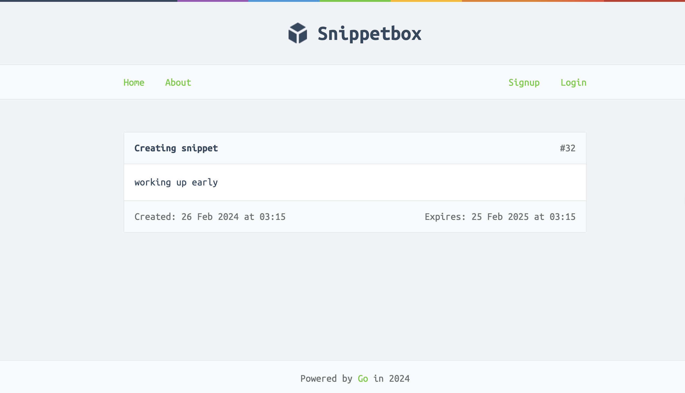

# Snippet Box



## Description

SnippetBox is a unique online platform that allows users to share and discover fascinating notes from people all around the world. Whether you're seeking inspiration, looking for practical tips, or simply want to connect with like-minded individuals, SnippetBox is the perfect place for you. 

## 🛠 Getting Started

#### Docker

If you have Docker installed on your system, in the root directory, run:

```bash
cd docker
docker compose up -d
```

The app will be up and running at http://localhost:8080. 

if you want to config -> change any environment in /docker/docker-compose.yaml file